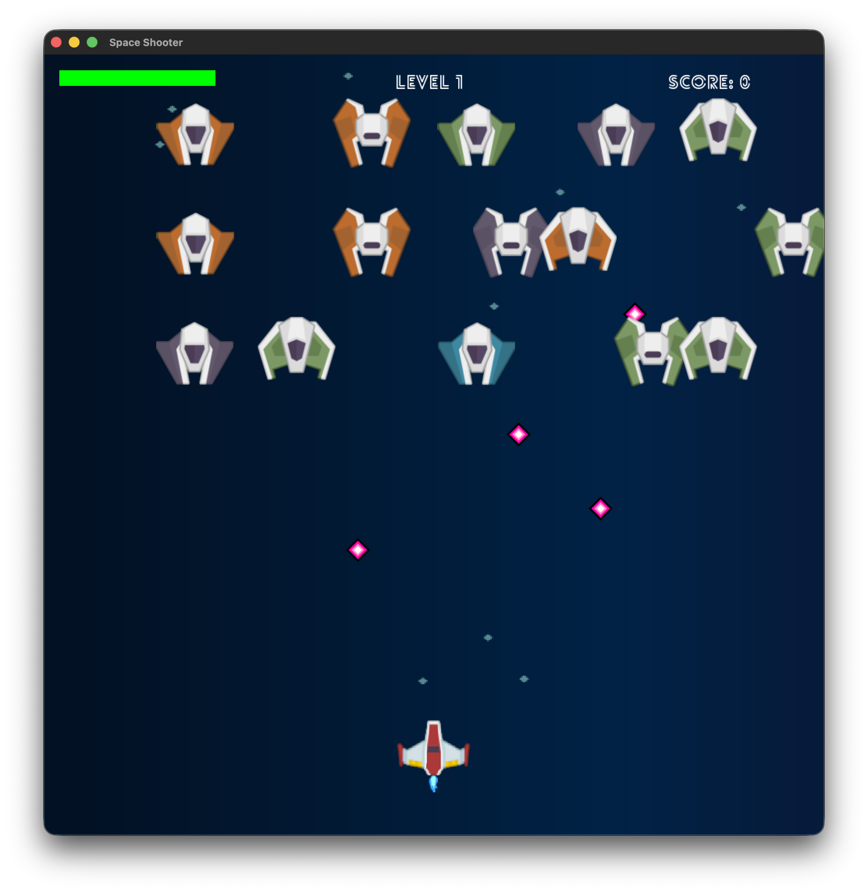
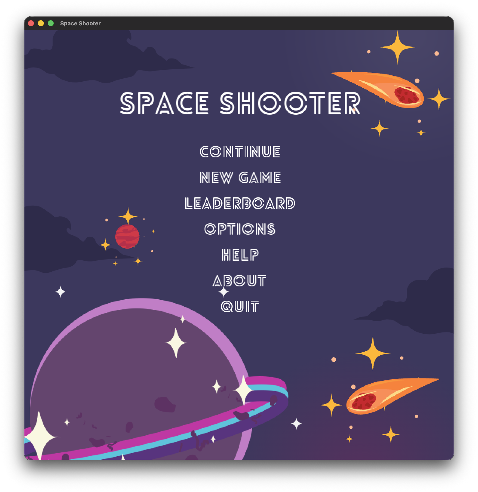
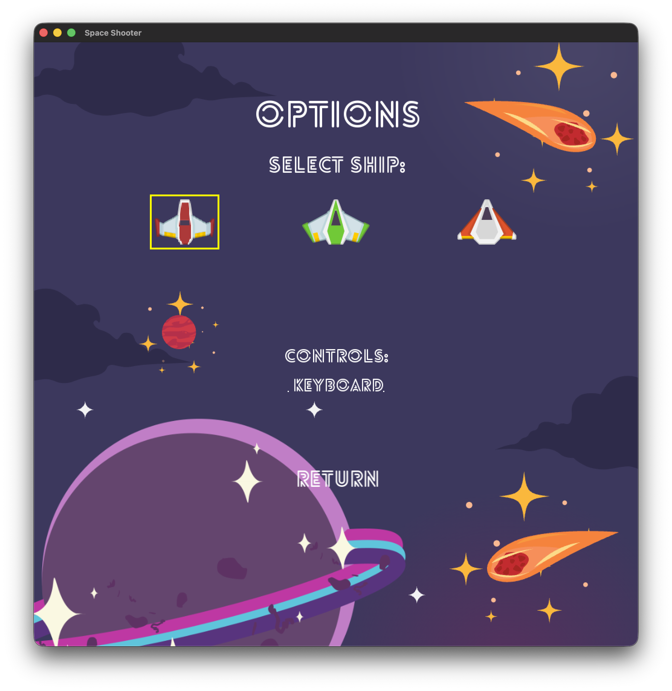
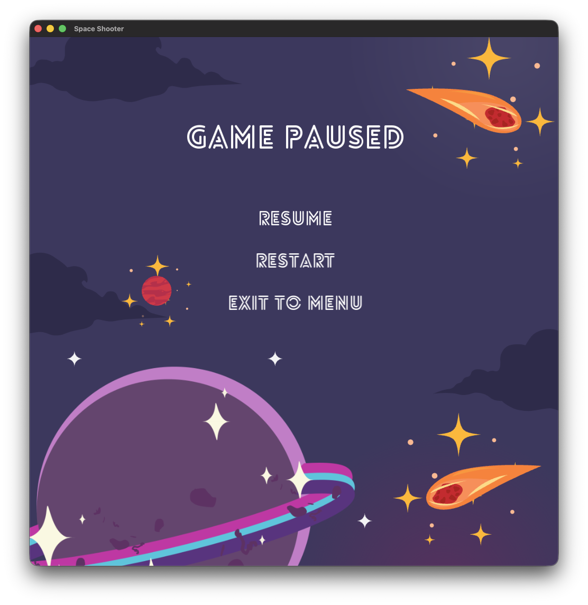

# Space Shooter

A classic arcade-style space shooter game built with modern C++17 and SFML 3.x.



## Features

- **Level Progression** - 3 levels with increasing difficulty + 2 boss battles
- **Multiple Enemy Types** - Alpha, Beta, Gamma invaders with unique attack patterns
- **Boss Battles** - Dragon (spread shots) and Monster (tracking beams)
- **Power-ups** - Health, Fire boost, Power-up, and Danger pickups
- **Ship Customization** - 3 ship types to choose from
- **Controls** - Keyboard (WASD/Arrows) or Mouse mode
- **Save System** - Complete game state saved to continue later
- **Leaderboard** - Top 10 scores saved locally

## Screenshots

| Main Menu | Options | Pause |
|:-:|:-:|:-:|
|  |  |  |

## Controls

| Action | Keyboard | Mouse Mode |
|--------|----------|------------|
| Move | WASD / Arrow Keys | Mouse position |
| Fire | Space | Left Click |
| Pause | Escape | Escape |

## Building

### Requirements
- C++17 compiler
- CMake 3.16+
- SFML 3.x

### Build Steps

```bash
mkdir build && cd build
cmake ..
make -j4
cd bin && ./SpaceShooter
```

## Project Structure

```
src/
├── Game.cpp/hpp          # Main game loop
├── Menu.cpp/hpp          # UI screens
├── LevelManager.cpp/hpp  # Level progression
├── ResourceManager.hpp   # Asset loading
└── entities/
    ├── Spaceship.cpp/hpp # Player
    ├── Bullet.cpp/hpp    # Projectiles
    ├── enemies/          # Enemy types
    └── powerups/         # Power-up types
```

## License

MIT License
